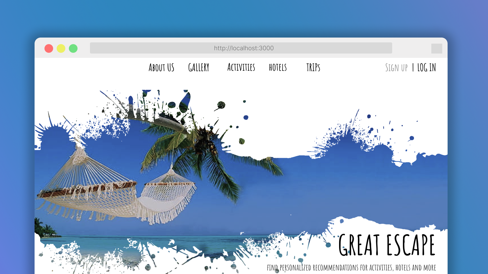

<h1 align="center">Great Escape</h1>

<p align="center">
<b>Great Escape</b> is a travel planner website. It recommends some features which allows to plan every aspect of your trip, from transport and accommodation to booking hotels, spending time in water sports. It shows numerous booking options, price details, and provides you the option to create your own custom-made travel bucket list.
</p>



## 🤩 Inspiration
We believe this hackathon is a great opportunity for our career-boost.  Moreover, this coastal theme is exciting and we would love to build some good UI designs for this. It's a great learning point to pitch new ideas, learn, improve our present skills and find the right approach to make this project successful. 


## ⚒️ How we built it
We started off by planning and customizing the UI design and what major things to include. Then we proceeded to build the backend, deal with database then tested and finalized. To make this project, we used many tech stacks and APIs. Some of them include - `React`, `NodeJS`, `ExpressJS`, `Auth0`, `MongoDB`, `GraphQL`, `Mongoose`, etc.


## API Reference

| Parameter | Type     | Description                |
| :-------- | :------- | :------------------------- |
| `api_key` | `string` | **Required**. Your API key |

#### Open GraphQL Interface endpoint 

- Hit the endpoint https://greate-escape.fly.dev/graphql

```bash
  GET https://greate-escape.fly.dev/graphql
```

| Parameter | Type     | Description                       |
| :-------- | :------- | :-------------------------------- |
| `id`      | `string` | **Required**. Id of item to fetch |
| `hotel_name`     | `string` | **Required**. Hotel Name of item to fetch |
| `imgurl`         | `string` | **Required**. Image URL of item to fetch |
| `despscription`  | `string` | **Required**. Despscription of item to fetch |
| `rating`         | `Float` | **Required**. Rating of item to fetch |
| `old_price`      | `Float` | **Required**. Old price of item to fetch |
| `new_price`      | `Float` | **Required**. New price of item to fetch |


### GraphQL Query
```bash
{
  hotels{
    hotel_name
    imgurl
    rating
    despscription
    rating
    old_price
    new_price
  }
}
```
### Query Response
```response
{
  "data": {
    "hotels": [
        {
        "hotel_name": "The Pallazzo",
        "imgurl": "https://cdn.....jpg?cb=1435955702",
        "rating": 4.5,
        "despscription": "The Palazzo Resort Hotel",
        "old_price": 785,
        "new_price": 2560
      },
      .
      .
      .
  }
}
```

## Environment Variables

To run this project, you will need to add the following environment variables to your `.env` file

- `DATABASE_URL` :  `mongodb+srv://<username>:<password>@cluster0.z1kkl.mongodb.net/<databaseName>?retryWrites=true&w=majority`

Edit `<user-name>` , `<password>` and `<databaseName>` 


##  Setting up development Environment


- Clone the project
    ```bash
  git clone https://github.com/<user-name>/great-escape
    ```

- Go to the project directory
    ```bash
  cd great-escape
    ```

- Install dependencies & start server
    ```bash
    npm install
    npm run dev
    ```


## 🚩 Challenges we ran into
We faced some issues while dealing with git version control when we tried pushing multiple commits but later we could figure that out. 

## 💪🏻 Accomplishments that we're proud of
We could successfully implement new features we learnt for this hackathon 
like GraphQL and could test out some others successfully.

## 📝 What we learned
We learned about some APIs. Most importantly, this hackathon taught us how to work and contribute together and accomplish more together, some troubleshooting methodologies and engaging with different tech stacks. 

## 🔮 What's next for Great Escape

We are planning to implement a decentralized system for booking rooms, implement itinerary and map in one view with no need of switching tabs, collaborate with friends in real time and a system to get personalized recommendations. 

## Authors and Maintainers

* [@siddhantprateek](https://github.com/siddhantprateek/)
* [@NikhitaBarat](https://github.com/NikhitaBarat)

### Contributors

* [Suvangi Paul](https://github.com/suvangipaul)


